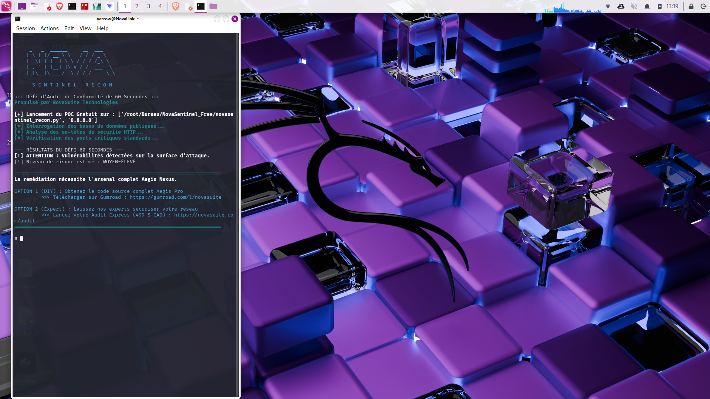

# 🛰️ NovaSentinel Recon Free (V1.5)

## ::: Défi d'Audit de Conformité de 60 Secondes :::
**Propulsé par NovaSuite Technologies (Rivière-du-Loup, Québec)**

<p align="center">
  
</p>

## 🚀 Qu'est-ce que NovaSentinel Recon ?

NovaSentinel Recon est une **Preuve de Concept (PoC)** gratuite, conçue pour les administrateurs système et les professionnels de la cybersécurité. En moins de 60 secondes, cet outil analyse votre surface d'attaque pour détecter les vulnérabilités les plus critiques.

> **NOTE :** Cette version gratuite identifie les failles potentielles mais ne fournit pas les détails techniques approfondis ni la remédiation automatique.

---

## 🔥 BESOIN DE PLUS DE PUISSANCE ?

Si le scan détecte des vulnérabilités, vous devez agir immédiatement pour protéger vos actifs.

### ⚔️ Passez à l'arsenal Aegis Nexus Pro

Obtenez la version Pro pour bénéficier de :
* 🚨 **Détails Techniques Complets** des failles détectées.
* 🛡️ **Remédiation Automatique** (Colmatage de ports et isolation réseau).
* 🔐 **QuantumShield Kyber-768** (NIST standard) pour vos données sensibles.
* 📊 **Rapports d'Audit Professionnels** exportables pour vos clients.

<p align="center">
  <a href="https://yarrowmartin.gumroad.com/l/fwzolr">
    
  </a>
</p>

---

## 🛠️ Installation et Utilisation

### Installation
```bash
git clone [https://github.com/yarrowmartin3-prog/NovaSentinel-Recon-Free.git](https://github.com/yarrowmartin3-prog/NovaSentinel-Recon-Free.git)
cd NovaSentinel-Recon-Free
Lancement de l'audit
Bash
python3 novasentinel_recon.py [IP_CIBLE]
💼 Services d'Expertise
Vous préférez qu'un expert de NovaSuite Technologies sécurise votre infrastructure ?
Obtenez un Audit Express Clé en Main (499 $ CAD) : https://novasuite.com/audit

© 2026 NovaSuite Technologies.
